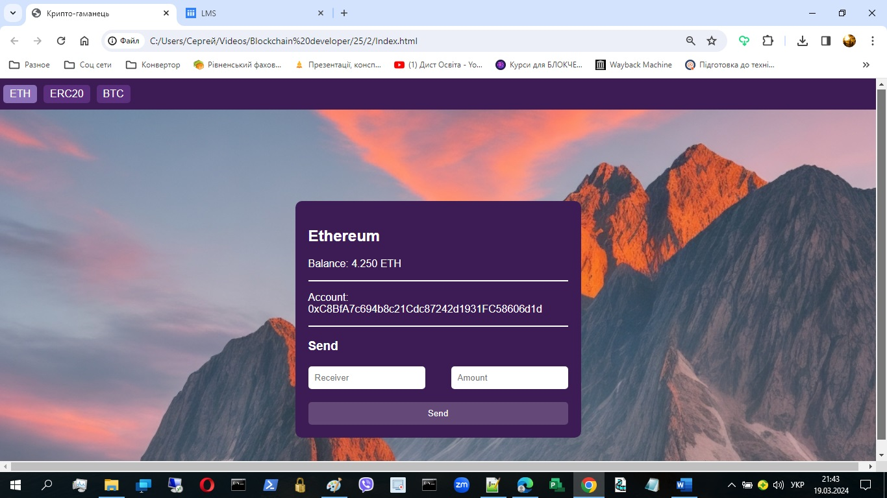

# Crypto Wallet - ETH & ERC20 Token Manager

A web-based cryptocurrency wallet application that enables users to manage Ethereum (ETH) and ERC20 tokens through MetaMask integration. This project demonstrates blockchain interaction, smart contract integration, and modern web development practices.



## Table of Contents

- [Features](#features)
- [Technology Stack](#technology-stack)
- [Project Structure](#project-structure)
- [Installation](#installation)
- [Usage](#usage)
- [Smart Contract Integration](#smart-contract-integration)
- [Architecture](#architecture)
- [Code Organization](#code-organization)
- [Security Considerations](#security-considerations)
- [Development](#development)
- [Testing](#testing)
- [Deployment](#deployment)
- [Contributing](#contributing)
- [License](#license)
- [Author](#author)

## Features

### Core Functionality
- **MetaMask Integration**: Seamless connection to MetaMask wallet
- **Multi-Currency Support**:
  - Native Ethereum (ETH) transactions
  - ERC20 token transfers (SERToken implementation)
- **Real-time Balance Display**: Automatic balance updates for both ETH and ERC20 tokens
- **Transaction Management**:
  - Send ETH to any Ethereum address
  - Transfer ERC20 tokens with decimal precision handling
  - Transaction hash tracking
  - Transaction confirmation monitoring

### User Interface
- **Responsive Design**: Mobile-friendly interface with custom background
- **Wallet Selector**: Easy switching between ETH and ERC20 wallets
- **Transaction Validation**: Client-side validation for addresses and amounts
- **Visual Feedback**: Active state indicators and transaction alerts

### Code Quality
- **Modular Architecture**: Separated concerns with dedicated files for ETH and ERC20 logic
- **Reusable Functions**: Helper functions for common operations
- **Error Handling**: Try-catch blocks for transaction failures
- **Type Validation**: Input validation for addresses and amounts

## Technology Stack

- **Frontend Framework**: Vanilla JavaScript (ES6+)
- **Blockchain Library**: [ethers.js](https://docs.ethers.io/) v5.2
- **Wallet Provider**: MetaMask
- **Smart Contract Standard**: ERC20
- **Network**: Ethereum Sepolia Testnet
- **Styling**: Custom CSS with background images
- **Version Control**: Git

## Project Structure

```
crypto-wallet/
│
├── Index.html              # Main HTML entry point
├── index.js                # Main application logic and wallet switching
├── eth.js                  # Ethereum wallet functionality
├── erc20.js                # ERC20 token functionality
├── styles.css              # Application styles
├── SERToken.json           # ERC20 token ABI (Smart Contract Interface)
├── .gitignore              # Git ignore rules
├── SendERC20.txt           # ERC20 transaction documentation
├── ДЗ-28.txt               # Project assignment details (Ukrainian)
│
└── images/                 # Image assets
    ├── 1.jpg               # UI screenshot
    └── img001.jpg          # Background image
```

## Installation

### Prerequisites

1. **MetaMask Browser Extension**
   - Install from [metamask.io](https://metamask.io/)
   - Create or import a wallet
   - Connect to Sepolia Testnet

2. **Sepolia Testnet ETH**
   - Obtain test ETH from [Sepolia Faucet](https://sepoliafaucet.com/)

3. **SERToken (Optional)**
   - Contract Address: `0xab98f7439a8e57cec30cb36e5152316ce7ba3372`
   - You can interact with the deployed token or deploy your own

### Setup Steps

1. **Clone the Repository**
   ```bash
   git clone <repository-url>
   cd crypto-wallet
   ```

2. **Configure the Application**
   - No build process required
   - All dependencies are loaded via CDN

3. **Launch the Application**
   - Open `Index.html` in a web browser
   - Or use a local server:
     ```bash
     # Using Python
     python -m http.server 8000

     # Using Node.js http-server
     npx http-server
     ```

4. **Connect MetaMask**
   - Click "Connect Metamask" button
   - Approve the connection request in MetaMask
   - Ensure you're on Sepolia Testnet

## Usage

### Connecting Wallet

1. Open the application in your browser
2. Click **"Connect Metamask"** button
3. Approve the connection in MetaMask popup
4. Your wallet address and balance will be displayed

### Sending Ethereum (ETH)

1. Ensure **ETH** wallet is selected (default)
2. Enter recipient address in **"Receiver"** field
3. Enter amount in **"Amount"** field (in ETH)
4. Click **"Send"** button
5. Confirm transaction in MetaMask
6. Wait for transaction confirmation
7. Transaction hash will be displayed in console

**Example Transaction:**
```
Receiver: 0xC6BdFA7e694db5621CdcB7242d1931FC586f6d1d
Amount: 0.0001 ETH
Network: Sepolia
```

### Sending ERC20 Tokens

1. Click **"ERC20"** button in wallet selector
2. Token balance will be displayed automatically
3. Enter recipient address
4. Enter token amount (without decimals - they're handled automatically)
5. Click **"Send"** button
6. Confirm transaction in MetaMask
7. Transaction hash logged to console

**Example Transaction:**
```
Receiver: 0xC6BdFA7e694db5621CdcB7242d1931FC586f6d1d
Amount: 10 SER tokens
Contract: 0xab98f7439a8e57cec30cb36e5152316ce7ba3372
```

### Verifying Transactions

After sending, verify on Etherscan:
```
https://sepolia.etherscan.io/tx/<transaction-hash>
```

## Smart Contract Integration

### ERC20 Token Contract

**Contract Address:** `0xab98f7439a8e57cec30cb36e5152316ce7ba3372`

The application interacts with a custom ERC20 token (SERToken) deployed on Sepolia testnet.

**Key Contract Methods Used:**
- `name()` - Get token name
- `decimals()` - Get token decimal places
- `balanceOf(address)` - Get token balance for address
- `transfer(address, uint256)` - Transfer tokens

### ABI Loading

The application loads the contract ABI from `SERToken.json`:

```javascript
const response = await fetch('SERToken.json');
const data = await response.json();
const ERC20_ABI = data.abi;
```

### Contract Instantiation

```javascript
const ERC20Contract = new ethers.Contract(
    ERC20Address,
    ERC20_ABI,
    provider // or signer for transactions
);
```

## Architecture

### Application Flow

```
User Action → MetaMask Connection → Web3Provider → ethers.js → Blockchain
                                                                      ↓
User Interface ← Balance Update ← Transaction Receipt ← Transaction Hash
```

### Module Separation

1. **index.js** - Main orchestrator
   - Wallet connection
   - Wallet type switching
   - Global state management

2. **eth.js** - Ethereum operations
   - ETH balance fetching
   - ETH transaction sending
   - Address validation
   - Decimal conversions

3. **erc20.js** - ERC20 operations
   - Token balance fetching
   - Token transfers
   - Contract interaction
   - Decimal handling per token

### Global State Management

```javascript
window.ethData = {
    provider: null,      // ethers.js Web3Provider instance
    signer: null,        // Signer for transactions
    userAddress: null,   // Connected wallet address
    chainId: null        // Network chain ID
}
```

## Code Organization

### Helper Functions (Reusable)

#### Address & Balance Functions
```javascript
// Get current connected address
const getCurrentAddress = async () => {
    return window.ethData.userAddress;
}

// Get current account (alias for getCurrentAddress)
const getCurrentAccount = async () => {
    return window.ethData.userAddress;
}

// Get ETH balance
const getCurrentBalance = async () => {
    return await window.ethData.provider.getBalance(
        getCurrentAddress()
    );
}

// Get ERC20 token balance
const getCurrentBalance = async (contract) => {
    return await contract.balanceOf(getCurrentAddress());
}
```

#### Transaction Functions
```javascript
// Send ETH transaction
const sendCurrency = async (to, amount) => {
    return await window.ethData.signer.sendTransaction({
        to: to,
        value: amount
    });
}

// Send ERC20 transaction
const sendCurrency = async (contract, to, amount) => {
    return await contract.transfer(to, amount);
}
```

#### Validation Functions
```javascript
// Validate Ethereum address and amount
const validate = (address, amount) => {
    if (!ethers.utils.isAddress(address)) {
        throw new Error('Invalid Ethereum address');
    }

    if (!ethers.BigNumber.isBigNumber(amount)) {
        throw new Error('Invalid amount');
    }
}
```

#### Conversion Functions
```javascript
// Convert to Wei (ETH - 18 decimals)
const toDecimals = (value) => {
    return ethers.utils.parseUnits(value, 18);
}

// Convert from Wei to ETH
const fromDecimals = (value) => {
    return ethers.utils.formatEther(value);
}

// Generic decimal conversion for ERC20
const toDecimals = (value, decimals) => {
    return ethers.utils.parseUnits(value, decimals);
}

const fromDecimals = (value, decimals) => {
    return ethers.utils.formatUnits(value, decimals);
}
```

#### Provider Functions
```javascript
// Get provider instance
const getProvider = () => {
    return window.ethData.provider;
}

// Set provider instance
const setProvider = (provider) => {
    window.ethData.provider = provider;
}
```

### Event Listeners

All event listeners are attached after DOM content is loaded:

```javascript
document.addEventListener('DOMContentLoaded', async (event) => {
    // Button event listeners
    connectButton.addEventListener('click', onConnect);
    ethWalletButton.addEventListener('click', prepareEthWrapper);
    erc20WalletButton.addEventListener('click', prepareERC20Wrapper);

    // Transaction buttons
    document.getElementById('ethSendButton')
        .addEventListener('click', onSendEth);
    document.getElementById('erc20SendButton')
        .addEventListener('click', onSendERC20);
});
```

## Security Considerations

### Best Practices Implemented

1. **No Private Keys**: Application never requests or handles private keys
2. **MetaMask Integration**: All signing happens in MetaMask
3. **Address Validation**: Client-side validation using ethers.js
4. **Amount Validation**: BigNumber validation for transaction amounts
5. **Error Handling**: Try-catch blocks prevent application crashes

### Security Warnings

⚠️ **Important Security Notes:**

- Never share your MetaMask seed phrase
- Always verify recipient addresses before sending
- Double-check transaction amounts
- Only use on trusted networks
- Be aware of gas fees before confirming transactions
- This is a testnet application - do not use on mainnet without additional security audits

### Potential Improvements

- [ ] Add transaction amount limits
- [ ] Implement address book for frequent recipients
- [ ] Add transaction history display
- [ ] Implement gas price estimation
- [ ] Add multi-signature support
- [ ] Implement token allowance management
- [ ] Add hardware wallet support

## Development

### Code Style

- **ES6+ JavaScript**: Modern syntax with async/await
- **Modular Design**: Separated files for different concerns
- **Descriptive Naming**: Clear function and variable names
- **Comments**: Ukrainian comments for key sections

### Debugging

Enable console logging for transaction details:

```javascript
console.log("Transaction Hash:", tx.hash);
console.log("Transaction Receipt:", result);
console.log(`Sending ${amount} ETH to ${recipient}`);
```

### MetaMask Events

Listen for account and network changes:

```javascript
// Account changed
window.ethereum.on('accountsChanged', (accounts) => {
    console.log('Account changed:', accounts[0]);
    // Refresh UI
});

// Network changed
window.ethereum.on('chainChanged', (chainId) => {
    console.log('Chain changed:', chainId);
    window.location.reload(); // Recommended by MetaMask
});
```

## Testing

### Manual Testing Checklist

#### Connection Tests
- [ ] MetaMask connection successful
- [ ] Correct network (Sepolia) detection
- [ ] Wallet address displayed correctly
- [ ] Balance displayed correctly

#### ETH Wallet Tests
- [ ] ETH balance loads correctly
- [ ] ETH send transaction works
- [ ] Invalid address rejected
- [ ] Invalid amount rejected
- [ ] Transaction hash received
- [ ] Balance updates after transaction

#### ERC20 Wallet Tests
- [ ] Token name displayed correctly
- [ ] Token balance loads correctly
- [ ] ERC20 send transaction works
- [ ] Decimal handling correct
- [ ] Transaction confirmation received
- [ ] Balance updates after transaction

#### UI Tests
- [ ] Wallet switching works (ETH ↔ ERC20)
- [ ] Active state indicators work
- [ ] Forms clear after successful send
- [ ] Error messages display properly
- [ ] Responsive on mobile devices

### Test Transactions

**ETH Test Transaction:**
```
Network: Sepolia
From: <Your Address>
To: 0xC6BdFA7e694db5621CdcB7242d1931FC586f6d1d
Amount: 0.0001 ETH
TX Hash: 0xea6eb94a521809ac7b759d6411214cf4a59cf31f765f1e4c548206eb922a645b
```

**ERC20 Test Transaction:**
```
Network: Sepolia
Token: SERToken (0xab98f7439a8e57cec30cb36e5152316ce7ba3372)
From: <Your Address>
To: 0xC6BdFA7e694db5621CdcB7242d1931FC586f6d1d
Amount: 10 SER
TX Hash: 0xe1fe45f3191b096e319a493bf4eea81f5eb39753da3026633286f47bd11b7fe9
```

## Deployment

### GitHub Pages Deployment

1. **Push to GitHub**
   ```bash
   git add .
   git commit -m "Initial commit"
   git branch -M main
   git remote add origin <your-repo-url>
   git push -u origin main
   ```

2. **Enable GitHub Pages**
   - Go to repository Settings
   - Navigate to Pages section
   - Select `main` branch as source
   - Click Save
   - Access at: `https://<username>.github.io/<repo-name>/`

3. **Custom Domain (Optional)**
   - Add CNAME file with your domain
   - Configure DNS settings with your provider

### Alternative Hosting Options

- **Vercel**: `vercel --prod`
- **Netlify**: Drag and drop folder or connect GitHub
- **IPFS**: Decentralized hosting for blockchain apps
- **Traditional Hosting**: Upload to any web server

## Contributing

Contributions are welcome! Please follow these guidelines:

1. **Fork the Repository**
2. **Create a Feature Branch**
   ```bash
   git checkout -b feature/your-feature-name
   ```
3. **Commit Your Changes**
   ```bash
   git commit -m "Add: your feature description"
   ```
4. **Push to Branch**
   ```bash
   git push origin feature/your-feature-name
   ```
5. **Open a Pull Request**

### Code Contribution Guidelines

- Maintain existing code style
- Add comments for complex logic (Ukrainian or English)
- Test thoroughly before submitting
- Update README if adding new features
- Keep commits atomic and descriptive

## License

This project is open source and available under the [MIT License](LICENSE).

```
MIT License

Copyright (c) 2024 Сергій Щербаков

Permission is hereby granted, free of charge, to any person obtaining a copy
of this software and associated documentation files (the "Software"), to deal
in the Software without restriction, including without limitation the rights
to use, copy, modify, merge, publish, distribute, sublicense, and/or sell
copies of the Software, and to permit persons to whom the Software is
furnished to do so, subject to the following conditions:

The above copyright notice and this permission notice shall be included in all
copies or substantial portions of the Software.

THE SOFTWARE IS PROVIDED "AS IS", WITHOUT WARRANTY OF ANY KIND, EXPRESS OR
IMPLIED, INCLUDING BUT NOT LIMITED TO THE WARRANTIES OF MERCHANTABILITY,
FITNESS FOR A PARTICULAR PURPOSE AND NONINFRINGEMENT. IN NO EVENT SHALL THE
AUTHORS OR COPYRIGHT HOLDERS BE LIABLE FOR ANY CLAIM, DAMAGES OR OTHER
LIABILITY, WHETHER IN AN ACTION OF CONTRACT, TORT OR OTHERWISE, ARISING FROM,
OUT OF OR IN CONNECTION WITH THE SOFTWARE OR THE USE OR OTHER DEALINGS IN THE
SOFTWARE.
```

## Author

**Сергій Щербаков (Sergiy Shcherbakov)**

- **Email**: sergiyscherbakov@ukr.net
- **Telegram**: [@s_help_2010](https://t.me/s_help_2010)
- **GitHub**: [Your GitHub Profile]

### Project Background

This project was developed as part of a blockchain development course (Homework Assignment 28). The assignment focused on:

1. Integrating ERC20 token support into an existing Ethereum wallet
2. Refactoring code for scalability and maintainability
3. Implementing helper functions for common blockchain operations
4. Adding validation and error handling
5. Creating a user-friendly interface for cryptocurrency management

**Assignment Completion:**
- ✅ ERC20 protocol integration
- ✅ Balance display for custom tokens
- ✅ Token transfer functionality
- ✅ Code refactoring with helper functions
- ✅ Validation implementation
- ✅ Transaction tracking with Etherscan verification

## Acknowledgments

- **ethers.js** - For the excellent blockchain interaction library
- **MetaMask** - For wallet integration capabilities
- **Sepolia Testnet** - For providing a safe testing environment
- **OpenZeppelin** - For ERC20 standard implementation guidance
- **Blockchain Development Course** - For the educational foundation

## Resources

### Documentation
- [ethers.js Documentation](https://docs.ethers.io/)
- [MetaMask Developer Docs](https://docs.metamask.io/)
- [ERC20 Token Standard](https://eips.ethereum.org/EIPS/eip-20)
- [Ethereum Developer Resources](https://ethereum.org/en/developers/)

### Tools
- [Sepolia Faucet](https://sepoliafaucet.com/)
- [Sepolia Etherscan](https://sepolia.etherscan.io/)
- [Remix IDE](https://remix.ethereum.org/) - For smart contract development

### Learning Resources
- [Ethereum Documentation](https://ethereum.org/en/developers/docs/)
- [Solidity Documentation](https://docs.soliditylang.org/)
- [Web3 Developer Roadmap](https://roadmap.sh/blockchain)

## Roadmap

### Current Features (v1.0)
- ✅ MetaMask connection
- ✅ ETH wallet management
- ✅ ERC20 token support
- ✅ Transaction sending
- ✅ Balance display

### Planned Features (v2.0)
- [ ] Bitcoin wallet integration (BTC button placeholder exists)
- [ ] Transaction history
- [ ] Multi-token support
- [ ] Token swap functionality
- [ ] Address book
- [ ] QR code scanning
- [ ] Gas price estimation
- [ ] Mobile app version

### Future Enhancements (v3.0)
- [ ] NFT support
- [ ] DeFi integration
- [ ] Multi-chain support (Polygon, BSC, etc.)
- [ ] Hardware wallet support
- [ ] Advanced analytics

## FAQ

**Q: Why can't I connect to MetaMask?**
A: Ensure MetaMask is installed and you're using a supported browser (Chrome, Firefox, Brave).

**Q: Why is my balance showing as 0?**
A: Make sure you're on Sepolia testnet and have test ETH/tokens. Check MetaMask network selection.

**Q: Transaction failed - what happened?**
A: Common causes: insufficient gas, insufficient balance, invalid recipient address. Check MetaMask error message.

**Q: Can I use this on Ethereum mainnet?**
A: Yes, but change the network in MetaMask. **Warning**: Transactions on mainnet cost real money.

**Q: How do I get SERToken?**
A: Contact the token deployer or deploy your own ERC20 contract using the provided ABI structure.

**Q: Is this production-ready?**
A: This is an educational project. Additional security audits and testing recommended for production use.

---

**Enjoy building with blockchain technology! 🚀**
